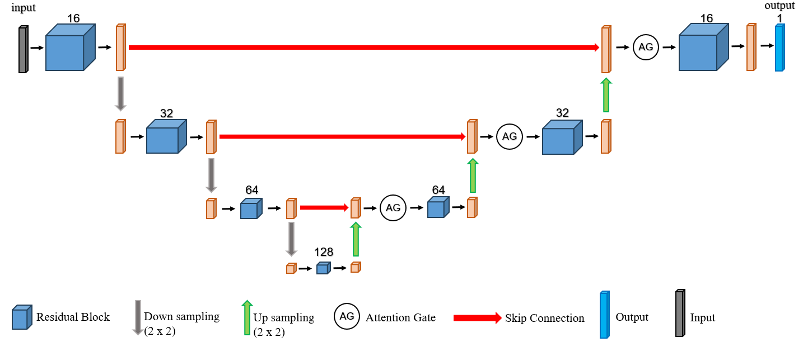
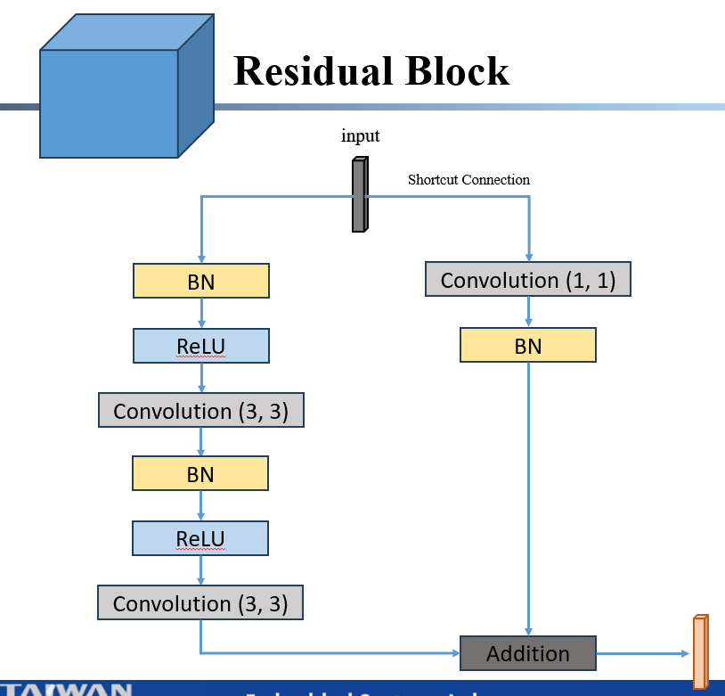
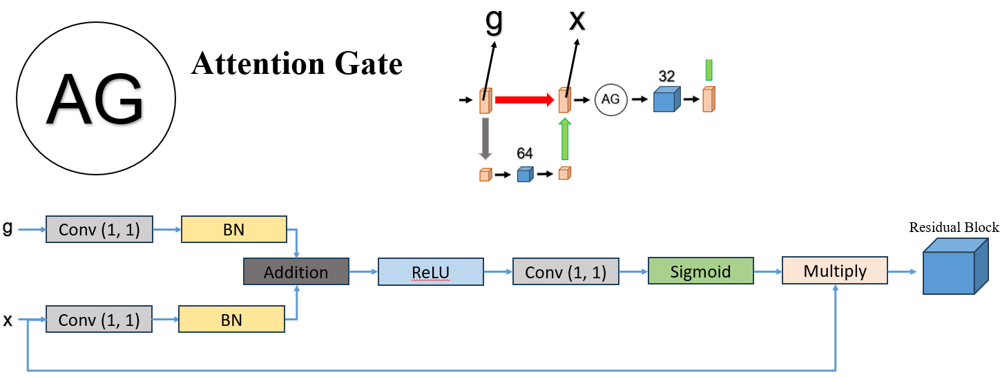
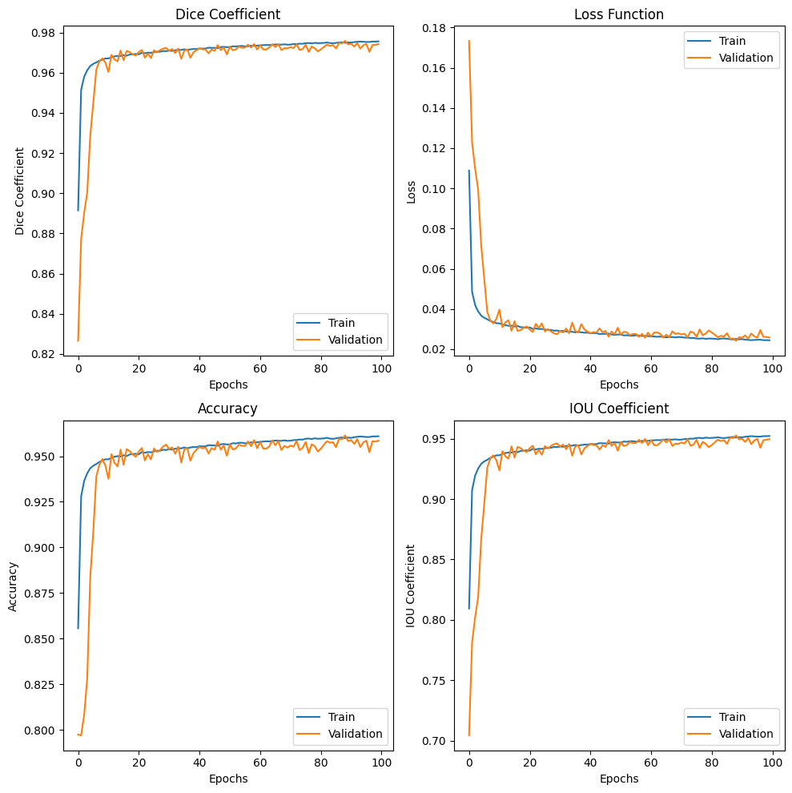

# Attention-Mechanism-Residual-UNet

## 簡介
模型架設程式練習...

訓練一個結合注意力機制和殘差塊的UNet，用來分割靜脈影像。

UNet部分參考[isbi challenge](https://github.com/zhixuhao/unet)

注意力機制和殘差塊則是參考兩篇arXiv提出的模塊加入上述變異的UNet中。

注意力機制[isbi challenge](https://arxiv.org/abs/1804.03999), Attention U-Net: Learning Where to Look for the Pancreas

殘差塊[isbi challenge](https://arxiv.org/abs/1711.10684), Road Extraction by Deep Residual U-Net

---

## 靜脈數據集
靜脈數據集來自[isbi challenge](https://www.kaggle.com/datasets/michaelgoh/contactless-knuckle-palm-print-and-vein-dataset)。可以在 `data/membrane` 資料夾中找到幾張原圖與自製標籤。

一共有1960張靜脈影像 資料集拆成7:2:1 用於 訓練:驗證:測試

分別將圖像放在下述資料夾

`data/membrane/train/image`

`data/membrane/val/val_imagee`

`data/membrane/test`

---

## 訓練標籤製作
訓練標籤製作: 

1. 自動伽瑪校正

2. CLAHE(clipLimit=2.0, tileGridSize=(4, 4))

3. 低通高斯濾波器去噪

4. 高通拉普拉斯濾波器

5. 反轉二值化 + otsu決定閾值

---

## 模型架構
主架構

殘差塊

注意力機制

---

## 訓練結果
Epoch 100/100
86/86 [==============================] - ETA: 0s - loss: 0.0245 - IOU_coefficient: 0.9523 - dice_coefficient: 0.9756 - accuracy: 0.9609
Epoch 100: loss improved from 0.02452 to 0.02446, saving model to best_model.hdf5
86/86 [==============================] - 28s 328ms/step - loss: 0.0245 - IOU_coefficient: 0.9523 - dice_coefficient: 0.9756 - accuracy: 0.9609 - val_loss: 0.0258 - val_IOU_coefficient: 0.9497 - val_dice_coefficient: 0.9742 - val_accuracy: 0.9585

---

## 使用方法
下載後直接執行 `train.ipynb` 或是 `train.py`。

---

## Requirements
python==3.9.2

tensorflow==2.10.0

opencv-python==4.5.3.56

scikit-image==0.19.3

scipy==1.13.0

numpy==1.26.4

matplotlib==3.8.0
