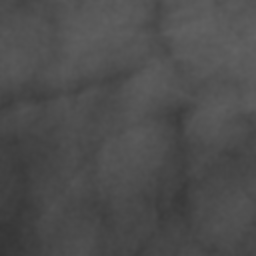
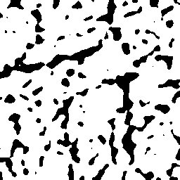
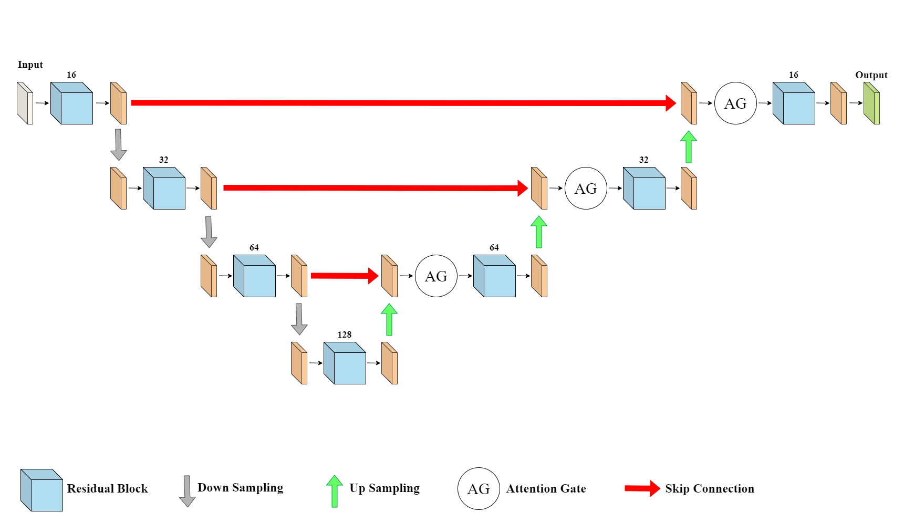
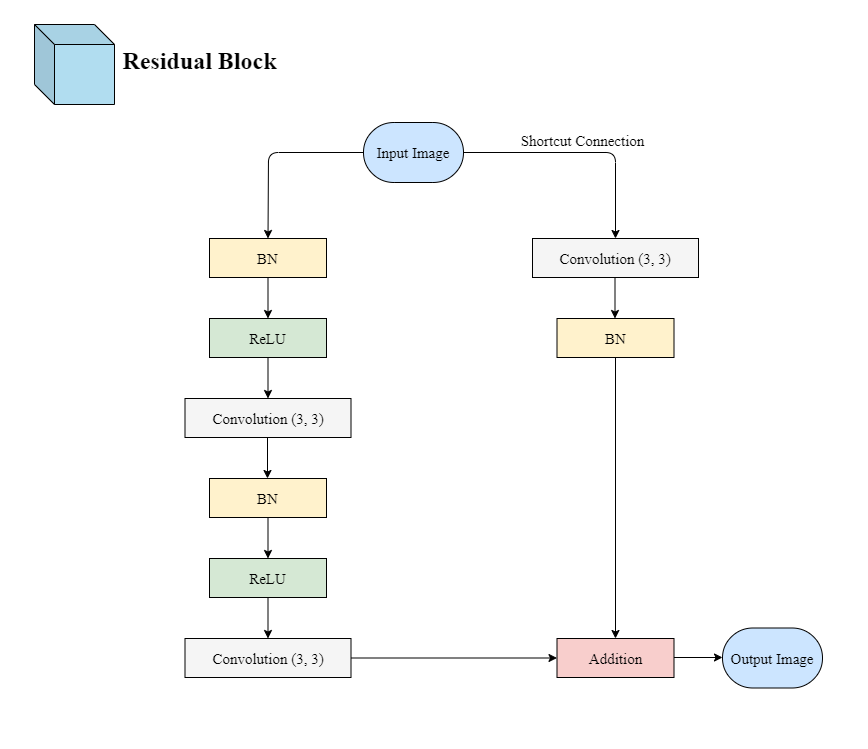
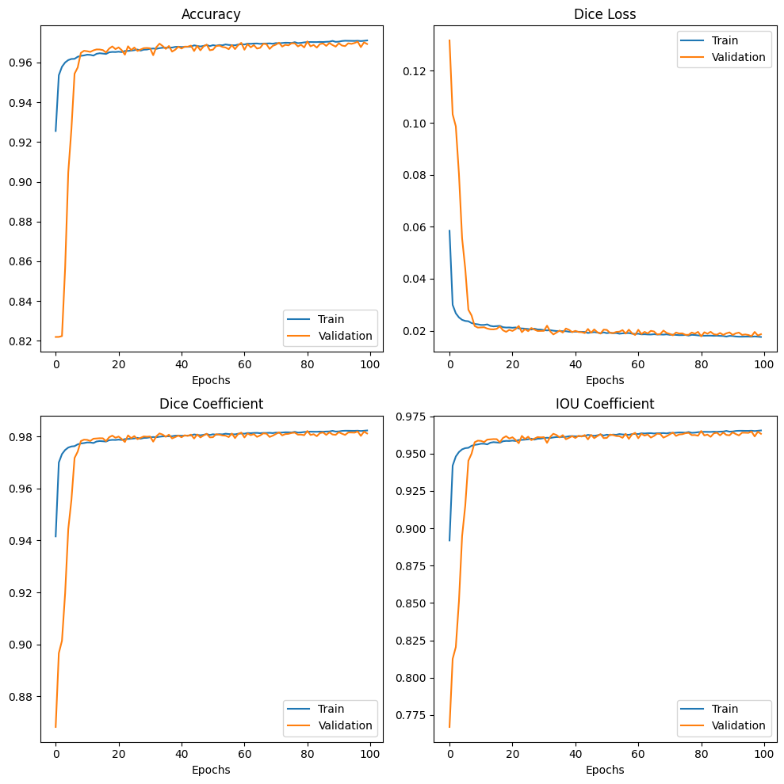
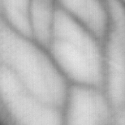
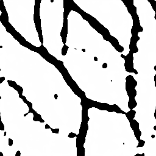

# Attention-Mechanism-Residual-UNet

## 簡介
程式練習...

訓練一個結合注意力機制和殘差塊的UNet，用來分割靜脈影像。

參考資料如下:

1. UNet 部分參考: [U-Net: Convolutional Networks for Biomedical Image Segmentation](https://arxiv.org/abs/1505.04597)

2. 變異 UNet 部分參考: [https://github.com/zhixuhao/unet](https://github.com/zhixuhao/unet)

注意力機制和殘差塊則是參考兩篇arXiv提出的模塊加入上述變異的 UNet 中。

3. 注意力機制: [Attention U-Net: Learning Where to Look for the Pancreas](https://arxiv.org/abs/1804.03999)

4. 殘差塊: [Road Extraction by Deep Residual U-Net](https://arxiv.org/abs/1711.10684)

---

## 靜脈資料集
靜脈資料集來自[https://github.com/wilchesf/dorsalhandveins](https://github.com/wilchesf/dorsalhandveins)。可以在 `data/membrane` 資料夾中看到幾張原圖與自製標籤。

資料集一共有1782張手背靜脈影像(自行提取感興趣區域) 拆成 7:2:1 用於 訓練:驗證:測試

分別將圖像跟對應的標籤放在下述資料夾。(image_size = 256 x 256)

訓練
`data/membrane/train/image`
`data/membrane/train/label`

驗證
`data/membrane/val/val_imagee`
`data/membrane/val/val_label`

測試
`data/membrane/test`

---

## 訓練標籤製作
1. 自動伽瑪校正
   
2. CLAHE(clipLimit=2.0, tileGridSize=(4, 4))
   
3. 低通高斯濾波器去噪
 
4. 高通拉普拉斯濾波器
   
5. 反轉二值化 + Otsu決定閾值

原圖與標籤

 

---

## 模型架構
主架構：

殘差塊：

注意力機制：

---

## 訓練結果
Epoch 100: loss improved from 0.01768 to 0.01759, saving model to best_model.hdf5
78/78 [==============================] - 21s 266ms/step - loss: 0.0176 - iou_coefficient: 0.9654 - dice_coefficient: 0.9824 - accuracy: 0.9711 - val_loss: 0.0187 - val_iou_coefficient: 0.9632 - val_dice_coefficient: 0.9813 - val_accuracy: 0.9693

用訓練好的模型預測測試集的圖片

 

---

## 使用方法
下載後直接執行 `main.ipynb` 

---

## Requirements
python==3.9.2

tensorflow(Keras)==2.10.0

opencv-python==4.5.3.56

scikit-image==0.19.3

numpy==1.26.4

matplotlib==3.8.0

CUDA 11.2

cuDNN 8.1.1

OS：windows10

GPU：RTX3060 12G
